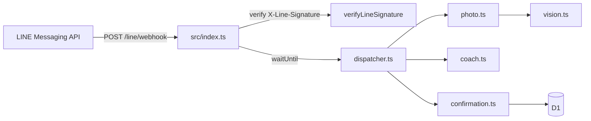

# LINE Integration Review and Next Steps

## Codebase review: what's already done

LINE is **partially integrated** — not starting from zero.

| Area | Status | Key files |
|------|--------|-----------|
| Webhook route + signature verify | Done | [`src/index.ts`](src/index.ts), [`src/channels/line.ts`](src/channels/line.ts) |
| `waitUntil` async processing | Done | Returns 200 immediately (required per [LINE webhook docs](https://developers.line.biz/en/docs/messaging-api/receiving-messages/)) |
| Text + image + postback parsing | Done | [`src/channels/line.ts`](src/channels/line.ts) `parseEvent()` |
| Image download | Done | `GET api-data.line.me/v2/bot/message/{id}/content` |
| Portion confirm UI | Done | Flex Message with `postback` buttons (`meal:log`, etc.) |
| Shared meal flow | Done | [`src/handlers/dispatcher.ts`](src/handlers/dispatcher.ts), `photo.ts`, `confirmation.ts` |
| Multi-channel users | Done (schema) | [`migrations/0003_multi_channel.sql`](migrations/0003_multi_channel.sql), [`src/db/users.ts`](src/db/users.ts) |
| Tests | Minimal | [`tests/line.test.ts`](tests/line.test.ts) — signature only |



---

## Gaps vs LINE Messaging API (prioritized)

### P0 — Required before real users

1. **LINE Developers Console setup** (no code)
   - Create provider + **Messaging API channel** at [LINE Developers Console](https://developers.line.biz/console/)
   - Issue **Channel secret** + **Channel access token** (long-lived)
   - Enable **Use webhook**; set URL to `{PUBLIC_BASE_URL}/line/webhook`
   - Disable auto-reply / greeting messages in console (avoid double replies)
   - Add bot as friend on your LINE account to test

2. **Production secrets + deploy**
   ```bash
   npx wrangler secret put LINE_CHANNEL_SECRET
   npx wrangler secret put LINE_CHANNEL_ACCESS_TOKEN
   npx wrangler d1 migrations apply arnold --remote   # includes 0003_multi_channel
   npm run deploy
   ```
   Verify: `GET /healthz` → `"line_enabled": true`

3. **No admin webhook helper for LINE** (unlike Telegram)
   - [`/admin/set-webhook`](src/index.ts) only registers Telegram
   - LINE webhook URL must be set in **console** or via API:
     `PUT https://api.line.me/v2/bot/channel/webhook/endpoint`
   - **Suggested code addition:** `POST /admin/set-line-webhook` in [`src/index.ts`](src/index.ts) + `LineChannel.setWebhook()` mirroring [`TelegramChannel.setWebhook`](src/channels/telegram.ts)

### P1 — LINE UX bugs to fix in code

4. **Flex button layout may break on LINE**

   [`src/channels/line.ts`](src/channels/line.ts) flattens all button rows into a **single horizontal footer**:

   ```typescript
   const footerButtons = buttons.flat().map(...)  // 3-4 buttons in one row
   ```

   LINE Flex footers work best with **vertical layout** or max ~3 buttons per horizontal row. Photo flow sends 3+1 buttons ([`src/handlers/photo.ts`](src/handlers/photo.ts)). Fix: map each `ButtonRow` to its own horizontal box inside a vertical footer, or use Quick Reply for simple confirms.

5. **`replyToken` not on `MessagingChannel` interface**

   [`LineChannel.sendText`](src/channels/line.ts) accepts `replyToken`, but [`MessagingChannel`](src/channels/types.ts) does not. Code uses `instanceof LineChannel` hacks in [`commands.ts`](src/handlers/commands.ts) and [`photo.ts`](src/handlers/photo.ts). Fix: add optional `replyToken` to the interface so all LINE replies use reply (free) instead of push (rate-limited).

6. **Postback without pending meal**

   Postback events set `callbackData` → `isCallback(msg)` is true. If user taps an old button with no `pending_meals` row, [`confirmation.ts`](src/handlers/confirmation.ts) replies "nothing pending" — OK, but no user feedback on invalid postbacks when `pending` is null and action text matches (edge case). Low priority.

### P2 — Reliability and product polish

7. **Webhook redelivery / idempotency**

   LINE may redeliver events ([receiving messages docs](https://developers.line.biz/en/docs/messaging-api/receiving-messages/)). No `webhookEventId` dedup exists. Add `webhook_events` table or store `webhookEventId` on `messages` with `INSERT OR IGNORE`.

8. **`follow` event for onboarding**

   LINE users often don't type `/start`. Handle `event.type === "follow"` in `parseEvent()` → send [`WELCOME`](src/handlers/commands.ts) via replyToken.

9. **Group/room chats not supported**

   Parser only uses `source.userId`. Group messages use `source.groupId` — replies would need `push` to group, different identity model. **Defer** unless you need group logging.

10. **README outdated**

    [`README.md`](README.md) still documents Python/Telegram-only setup. Add LINE section mirroring `.env.example`.

11. **Tests**

    Add vitest for `LineChannel.parseUpdate()` (text, image, postback) and Flex payload structure.

---

## Recommended integration sequence

### Phase A: Console + deploy (today, no code)

1. LINE Developers Console → Messaging API channel
2. Webhook URL: `https://tryarnold.shrujan-beesetty.workers.dev/line/webhook`
3. `wrangler secret put` for LINE secrets on **remote** worker
4. Apply migration `0003_multi_channel.sql` on remote D1
5. Deploy `typescript` branch (merge to `main` first if Builds only deploys `main`)
6. Add bot as friend; send text + food photo

### Phase B: Code fixes (1 PR)

| Task | File |
|------|------|
| Fix Flex footer layout (vertical rows) | [`src/channels/line.ts`](src/channels/line.ts) |
| Add `replyToken` to `MessagingChannel` | [`src/channels/types.ts`](src/channels/types.ts), callers |
| Add `LineChannel.setWebhook()` + `/admin/set-line-webhook` | [`src/channels/line.ts`](src/channels/line.ts), [`src/index.ts`](src/index.ts) |
| Handle `follow` event → WELCOME | [`src/channels/line.ts`](src/channels/line.ts) |
| Update README + `.env.example` notes | docs |

### Phase C: Hardening (optional follow-up)

- Webhook event dedup
- Integration tests for full photo → postback → meal flow on LINE
- Quick Reply alternative for portion buttons (simpler than Flex)

---

## LINE vs Telegram differences (for testing)

| | Telegram | LINE |
|---|----------|------|
| Webhook setup | `/admin/set-webhook` | Console or new admin endpoint |
| Buttons | Inline keyboard | Flex postback |
| User ID | integer | string (`U...`) |
| Image caption | supported | not in current parser |
| Commands | `/start`, `/progress` | same text works if user types them |
| Async processing | inline | `waitUntil` (already implemented) |

---

## Verification checklist

After Phase A + B:

- [ ] `GET /healthz` → `line_enabled: true`
- [ ] Add bot as friend → receive welcome (follow or `/start`)
- [ ] Text message → coach reply via OpenRouter
- [ ] Food photo → Flex buttons → tap Medium → meal logged in D1
- [ ] `/progress` → today's totals
- [ ] Wrong signature → 403 on `/line/webhook`

---

## References

- [LINE Developers documentation](https://developers.line.biz/en/docs/)
- [Messaging API — receiving messages / webhooks](https://developers.line.biz/en/docs/messaging-api/receiving-messages/)
- [Flex Message layout](https://developers.line.biz/en/docs/messaging-api/using-flex-messages/)
- Existing implementation: [`src/channels/line.ts`](src/channels/line.ts)
