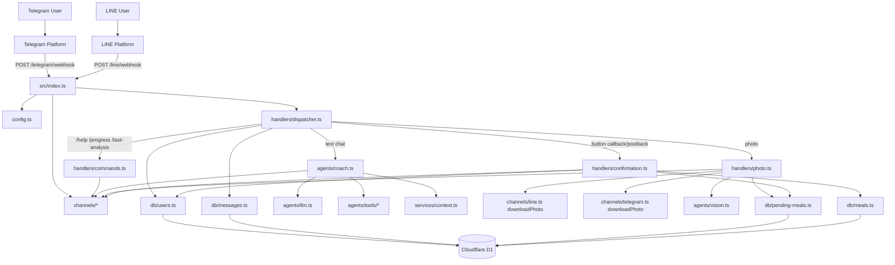
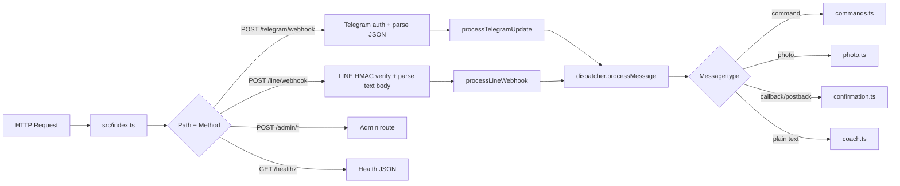

# TryArnold Codebase Review

## Findings

- High: the Python worker path exposes admin webhook-management routes without any auth check. In the currently deployed setup this is not the active entrypoint, because `wrangler.toml` points to `src/index.ts`, but if `src/entry.py` is ever used again, `/admin/set-webhook` and `/admin/delete-webhook` are callable by anyone. Compare the guarded TypeScript routes in `src/index.ts` with the unguarded Python ones in `src/entry.py`.

```text
49:57:src/index.ts
      if (method === "POST" && path === "/telegram/webhook") {
        const secret = request.headers.get("x-telegram-bot-api-secret-token") ?? "";
        if (secret !== settings.telegramWebhookSecret) {
          return jsonResponse({ detail: "invalid secret token" }, 403);
        }
```

```text
110:128:src/entry.py
                if method == "POST" and path == "/admin/set-webhook":
                    try:
                        from app.worker_app import set_webhook, sync_settings

                        sync_settings()
                        return _json_response(await set_webhook())
```

- Medium: the active TypeScript photo flow still contains temporary debug instrumentation that logs meal-analysis internals and posts to a hardcoded localhost ingest endpoint on every photo request. That is useful during debugging, but it is noisy in production and leaks structured meal metadata into worker logs. This is present in both `src/handlers/photo.ts` and `src/agents/vision.ts`.

```text
11:40:src/handlers/photo.ts
function debugLog(message: string, hypothesisId: string, data: Record<string, unknown>): void {
  // #region agent log
  console.error(
    "LINE_PHOTO_DEBUG",
    JSON.stringify({
      sessionId: "ae6431",
      runId: "pre-fix-console",
      hypothesisId,
      location: "src/handlers/photo.ts",
      message,
      data,
      timestamp: Date.now(),
    }),
  );
  fetch("http://127.0.0.1:7685/ingest/9e085500-f454-4050-a819-bbbb69fc0e17", {
```

- Medium: LINE webhooks are acknowledged before business logic finishes, so failures after signature verification are invisible to LINE at the HTTP layer. That is a valid latency tradeoff, but it means DB/AI/message-send failures become “accepted but dropped” events unless you have reliable log monitoring. Telegram, by contrast, processes inline and can return `500`. The asymmetry is in `src/index.ts`.

```text
76:99:src/index.ts
      if (method === "POST" && path === "/line/webhook") {
        if (!settings.lineChannelSecret) {
          return jsonResponse({ detail: "LINE not configured" }, 503);
        }

        const body = await request.text();
        const signature = request.headers.get("x-line-signature") ?? "";
        const valid = await verifyLineSignature(
          body,
          signature,
          settings.lineChannelSecret,
        );
        if (!valid) {
          return jsonResponse({ detail: "invalid signature" }, 403);
        }

        const payload = JSON.parse(body);
        const channel = new LineChannel(settings);
        ctx.waitUntil(
          processLineWebhook(env, env.DB, channel, payload).catch((err) => {
            console.error("LINE webhook processing failed", err);
          }),
        );
        return jsonResponse({ ok: true });
      }
```

- Low: the new vision retry path that fixed the `0 kcal` issue does not appear to have direct automated coverage yet. Current tests cover LINE parsing and a few DB/tool behaviors, but not `estimateFromImage()` or the “recognized items but zero macros” retry branch in `src/agents/vision.ts`. That makes this regression-prone.

## Project Structure

The repo currently contains two app implementations:

1. Active TypeScript Cloudflare Worker
   - This is what production runs right now.
   - Proven by `wrangler.toml` using `main = "src/index.ts"`.

2. Older/parallel Python worker implementation
   - Lives under `src/app` plus `src/entry.py`.
   - It mirrors much of the same business logic, but it is not the active worker for the current deployment.

### High-level tree

```text
tryarnold/
├── wrangler.toml                 # Cloudflare Worker config; active entry is src/index.ts
├── migrations/                   # D1 schema changes
├── tests/                        # Vitest tests for TS app
├── src/
│   ├── index.ts                  # Active Worker HTTP entrypoint
│   ├── config.ts                 # Env -> typed settings
│   ├── env.ts                    # Worker binding/env types
│   ├── channels/                 # Platform adapters
│   │   ├── types.ts              # Common inbound/outbound message contract
│   │   ├── telegram.ts           # Telegram API + update parsing
│   │   └── line.ts               # LINE API + webhook parsing
│   ├── handlers/                 # Request/business flow
│   │   ├── dispatcher.ts         # Main message router
│   │   ├── commands.ts           # /help /progress /last-analysis
│   │   ├── photo.ts              # Photo -> vision -> pending meal prompt
│   │   └── confirmation.ts       # Button callbacks -> finalize meal
│   ├── agents/                   # LLM integrations
│   │   ├── llm.ts                # OpenRouter model factories
│   │   ├── coach.ts              # Text chat agent
│   │   ├── vision.ts             # Image nutrition estimation
│   │   └── tools/                # Agent tools
│   ├── db/                       # D1 queries
│   │   ├── client.ts             # Thin D1 helpers
│   │   ├── users.ts              # User identity + daily totals
│   │   ├── meals.ts              # Meal persistence
│   │   ├── messages.ts           # Chat log persistence
│   │   └── pending-meals.ts      # Pre-confirmation photo estimates
│   ├── services/                 # Shared logic
│   │   ├── context.ts            # Recent context for coach agent
│   │   ├── pending-meal.ts       # Portion action normalization/factors
│   │   └── text-style.ts         # Reply cleanup/styling
│   ├── schemas/
│   │   └── nutrition.ts          # Macro estimate schema + transforms
│   └── app/                      # Older Python implementation subtree
│       ├── worker_app.py
│       ├── channels/
│       ├── schemas/
│       └── services/
└── README.md
```

## Architecture Diagram

### System view



### Active TypeScript request flow



## Which code is active right now?

The deployed worker is the TypeScript app, not the Python app.

```text
1:4:wrangler.toml
name = "tryarnold"
main = "src/index.ts"
compatibility_date = "2025-10-16"
compatibility_flags = ["nodejs_compat"]
```

That means:
- `src/index.ts` is the real HTTP entrypoint.
- `src/app/*` and `src/entry.py` are best understood as a legacy or parallel implementation, not the current runtime.

## How POST Requests Are Handled

There are seven active POST routes in the TypeScript worker.

### 1. `POST /telegram/webhook/ping`

Purpose: simple health-style POST probe.

Flow:
1. `src/index.ts` matches the route.
2. Immediately returns `{ ok: true, ping: true }`.
3. No auth besides being the route itself.
4. No DB/agent work.

### 2. `POST /telegram/webhook`

Purpose: receive Telegram messages and callbacks.

Flow in detail:
1. `src/index.ts` checks `x-telegram-bot-api-secret-token`.
2. If the header does not equal `settings.telegramWebhookSecret`, it returns `403`.
3. If valid, it parses JSON with `await request.json()`.
4. Creates `new TelegramChannel(settings)`.
5. Calls `processTelegramUpdate(env, env.DB, channel, update)`.
6. Any thrown error returns a structured `500` response.

Inside `processTelegramUpdate`:
1. `TelegramChannel.parseUpdate()` converts raw Telegram webhook payload into one normalized `InboundMessage`.
2. `processMessage()` runs the common app flow.

Inside `processMessage()`:
1. `getOrCreateUser()` loads or inserts a `users` row.
2. `logMessage(..., "in", ...)` writes the inbound message to `messages`.
3. Branches by intent:
   - follow/start => `handleCommand("/start")`
   - slash command => `handleCommand()`
   - callback with pending meal => `handleConfirmation()`
   - photo => `handlePhoto()`
   - text => `runCoachAgent()`

Telegram adapter responsibilities in `src/channels/telegram.ts`:
- `call()` sends Bot API POSTs like `sendMessage`, `getFile`, `setWebhook`.
- `parseUpdate()` normalizes Telegram `message`, `edited_message`, and `callback_query`.
- `downloadPhoto()` first calls Telegram `getFile`, then downloads file bytes from Telegram’s file CDN.

### 3. `POST /line/webhook`

Purpose: receive LINE text, image, follow, and postback events.

Flow in detail:
1. `src/index.ts` checks that `LINE_CHANNEL_SECRET` exists; otherwise `503`.
2. Reads the raw request body with `await request.text()`.
3. Pulls `x-line-signature`.
4. Calls `verifyLineSignature(body, signature, secret)`.
5. If invalid, returns `403`.
6. Parses body JSON.
7. Creates `new LineChannel(settings)`.
8. Calls `ctx.waitUntil(processLineWebhook(...))`.
9. Returns `{ ok: true }` immediately.

Important behavioral difference:
- Telegram webhook processing is inline.
- LINE webhook processing is deferred with `waitUntil`, so the HTTP response is decoupled from downstream success/failure.

Inside `processLineWebhook()`:
1. `LineChannel.parseUpdate()` returns an array of normalized `InboundMessage`s because one LINE webhook may contain multiple events.
2. It loops each message through `processMessage()`.

LINE adapter responsibilities in `src/channels/line.ts`:
- `verifyLineSignature()` computes HMAC-SHA256 over the raw body.
- `parseUpdate()` extracts `follow`, `postback`, `text`, and `image` events.
- `downloadPhoto()` fetches binary content from `https://api-data.line.me/v2/bot/message/{messageId}/content`.
- `sendTextWithKeyboard()` renders a Flex bubble with postback buttons.

### 4. `POST /admin/set-webhook`

Purpose: tell Telegram which URL to send updates to.

Flow:
1. `checkAdminAuth()` compares `X-Admin-Secret` to `settings.adminSecret`.
2. If auth fails, returns `401`.
3. Creates `TelegramChannel`.
4. Calls `channel.setWebhook()`, which makes a Telegram Bot API POST to `setWebhook`.
5. Returns `{ ok, url }` or `502` on upstream failure.

### 5. `POST /admin/delete-webhook`

Purpose: remove Telegram webhook.

Flow:
1. Same `X-Admin-Secret` check.
2. Calls `TelegramChannel.deleteWebhook()`.
3. Returns `{ ok }` or `502`.

### 6. `POST /admin/set-line-webhook`

Purpose: configure the LINE Messaging API webhook endpoint.

Flow:
1. Same admin-secret auth.
2. Creates `LineChannel`.
3. Calls `LineChannel.setWebhook()`, which sends a `PUT` to LINE’s webhook endpoint API.
4. Returns `{ ok, url }` or `502`.

### 7. `POST /admin/delete-line-webhook`

Purpose: remove LINE webhook configuration.

Flow:
1. Same admin-secret auth.
2. Calls `LineChannel.deleteWebhook()`, which sends `DELETE` to LINE’s webhook endpoint API.
3. Returns `{ ok }` or `502`.

## The Shared Business Flow After a Webhook

Both Telegram and LINE normalize into the same `InboundMessage` shape from `src/channels/types.ts`.

That contract contains:
- user identity: `externalUserId`, `channel`, `chatId`
- payload data: `text`, `caption`, `photo`
- callback data: `callbackData`, `callbackQueryId`, `replyToken`
- metadata: `username`, `firstName`, `raw`

That is why almost all app logic is channel-agnostic after parsing.

### Text message flow

1. Webhook reaches `processMessage()`.
2. User row is loaded/created in `db/users.ts`.
3. Message logged in `db/messages.ts`.
4. If it’s not a slash command, `runCoachAgent()` is called.
5. `runCoachAgent()`:
   - builds durable context from recent meals/messages via `services/context.ts`
   - creates a LangGraph ReAct agent
   - attaches tools from `agents/tools`
   - uses OpenRouter chat model from `agents/llm.ts`
6. Final text is styled and sent through the channel adapter.
7. Outbound reply is also logged in `messages`.

### Photo flow

1. `handlePhoto()` downloads binary image bytes using the channel adapter.
2. `estimateFromImage()` in `agents/vision.ts` sends the image to the OpenRouter vision model.
3. The result is parsed into the nutrition schema.
4. A pending estimate is stored in `pending_meals`.
5. User receives a confirmation prompt:
   - if portion confidence is low: ask `Small / Medium / Large / Skip`
   - otherwise: show `Log / Smaller / Bigger / Skip`

### Confirmation flow

1. Button tap arrives as Telegram callback or LINE postback.
2. `normalizeActionWithSettings()` interprets `meal:log`, `meal:size_s`, etc.
3. `handleConfirmation()` loads the pending estimate.
4. Applies selected size multiplier if needed.
5. Inserts final meal into `meals`.
6. Optionally updates the user’s learned `portion_multiplier`.
7. Deletes the pending estimate.
8. Sends final “logged X kcal” message.

## Data Layer

The D1 helpers are intentionally thin in `src/db/client.ts`:
- `dbAll()` => query many
- `dbFirst()` => first row or `null`
- `dbRun()` => execute mutation
- `utcNow()` => timestamp helper
- `startOfDayInTimezone()` => timezone-aware day boundary

The domain tables implied by the code are:

- `users`
  - identity across channel + external ID
  - timezone
  - portion learning factor
  - goal metadata

- `messages`
  - inbound/outbound transcript log
  - channel and kind (`text`, `photo`, `system`)

- `pending_meals`
  - temporary photo estimate awaiting confirmation
  - estimate JSON
  - media refs
  - TTL via `created_at`

- `meals`
  - final persisted nutrition entries
  - description, calories, macros, confidence, items JSON

## AI Layer

There are really two AI subsystems.

### 1. Conversational coach

`src/agents/coach.ts`
- ReAct-style agent
- has tools for:
  - today’s progress
  - recent meals
  - logging food from text
- used only for normal text chat

### 2. Vision estimator

`src/agents/vision.ts`
- accepts raw image bytes
- base64-encodes image
- asks the OpenRouter vision model for structured nutrition JSON
- now has stricter output validation and a retry path if foods are recognized but macros are all zero

## Python Subtree

The Python code under `src/app` mirrors the same product idea:
- webhook entry
- Telegram channel adapter
- D1 helpers
- photo handling
- AI chat/vision calls

But at the moment it is not the app Cloudflare is configured to run. Treat it as:
- legacy implementation
- migration artifact
- or alternate runtime experiment

That distinction matters because some behavior differs between TS and Python, especially:
- channel support
- admin auth
- routing shape
- model integration details

## Bottom line

If you want the simplest mental model, think of the active app as:

`src/index.ts` receives webhooks -> channel adapters normalize platform payloads -> `dispatcher.ts` decides command/text/photo/callback -> handlers call D1 + OpenRouter -> channel adapters send replies back.
