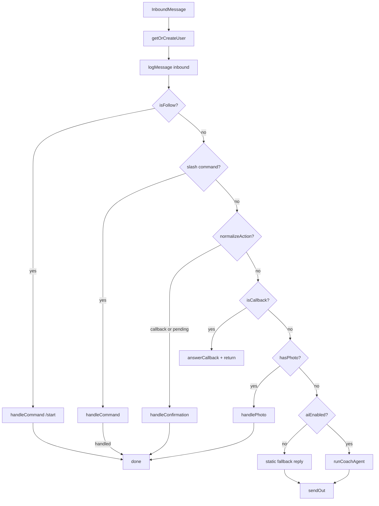

# TryArnold — Architecture, Core Logic & Redundancy Review

> Generated: 2026-07-10  
> Active runtime: **TypeScript Worker** (`wrangler.toml` → `src/index.ts`)  
> Scope: full repo including legacy Python subtree and recent landing-page work

---

## Executive summary

TryArnold is a **Cloudflare Worker + D1** nutrition coach that receives webhooks from **Telegram** and **LINE**, normalizes them into a shared message shape, and routes each message through command handling, photo vision analysis, meal confirmation, or an AI coach agent (LangGraph + OpenRouter).

The architecture is sound: channel adapters → dispatcher → handlers → D1 + LLM → channel replies. The main maintenance risks are **(1)** a full duplicate Python implementation that is no longer deployed, **(2)** leftover debug instrumentation in production paths, **(3)** several dead-code / duplicate-helper artifacts from the TS migration, and **(4)** almost no automated tests despite `npm test` being documented.

---

## Findings (severity order)

### High

| # | Issue | Location | Notes |
|---|-------|----------|-------|
| H1 | **Legacy Python admin routes have no auth** | `src/entry.py` | `/admin/set-webhook` and `/admin/delete-webhook` are unguarded. Not active today (`main = src/index.ts`), but dangerous if Python entry is re-enabled. TS routes correctly use `X-Admin-Secret`. |
| H2 | **Default webhook secret is weak** | `src/config.ts` | `TELEGRAM_WEBHOOK_SECRET` falls back to `"change-me"`. Production must override via secret; forgetting this leaves webhook spoofing open. |
| H3 | **No automated tests in repo** | `package.json`, `tests/` | README documents `npm test`, vitest is installed, but there are **zero** `*.test.ts` files. Regression-prone areas: vision retry, LINE parsing, confirmation flow, signature verification. |

### Medium

| # | Issue | Location | Notes |
|---|-------|----------|-------|
| M1 | **Debug instrumentation in production photo path** | `src/handlers/photo.ts`, `src/agents/vision.ts` | Duplicated `debugLog()` posts meal metadata to `http://127.0.0.1:7685/ingest/...` and logs `LINE_PHOTO_DEBUG` on every photo. Noisy, leaks structured nutrition data, localhost fetch is a no-op in prod but still costs a fetch. |
| M2 | **LINE webhooks ack before processing** | `src/index.ts` | `ctx.waitUntil(processLineWebhook(...))` returns `{ ok: true }` immediately. Failures after HMAC verify are invisible to LINE (silent drops unless logs are monitored). Telegram processes inline and can return 500. |
| M3 | **Landing page CTA links default to `#`** | `wrangler.toml`, `src/landing/page.ts` | `TELEGRAM_BOT_URL` and `LINE_ADD_URL` are `"#"`. Page renders but primary CTAs go nowhere until configured. |
| M4 | **Unknown confirmation action deletes pending meal** | `src/handlers/confirmation.ts` | `factor === undefined` branch deletes pending meal and says "skipped". Should be unreachable if dispatcher only passes normalized actions, but if reached it destroys user data on malformed callback. |

### Low

| # | Issue | Location | Notes |
|---|-------|----------|-------|
| L1 | **Double `stripEmoji` on outbound text** | `handlers/commands.ts` + `channels/*.ts` | `sendOut()` strips emoji, then channel `sendText()` strips again. Harmless but redundant. |
| L2 | **`photo.ts` bypasses `sendOut` for keyboard prompts** | `src/handlers/photo.ts` | Manually calls `channel.sendTextWithKeyboard` + `logMessage` instead of a shared outbound helper. Duplicates outbound logging pattern. |
| L3 | **Four copy-pasted admin route blocks** | `src/index.ts` | Telegram/LINE set/delete webhook handlers share identical auth + try/catch structure. Could be one helper. |
| L4 | **`fatsecret_enabled: false` hardcoded** | `src/index.ts` `/healthz` | Stale health field; landing page mentions FatSecret as "coming soon". |

---

## What is redundant?

### 1. Entire Python implementation (largest redundancy)

| Path | Status |
|------|--------|
| `src/entry.py` | Legacy Worker entry (OpenAI keys, Telegram-only, no LINE, no landing page) |
| `src/app/**` | Mirrors channels, schemas, services, worker_app |
| `pyproject.toml`, `scripts/measure_worker_bundle.py` | Python tooling |

**Verdict:** Not deployed. `wrangler.toml` points to `src/index.ts`. Safe to archive or delete once you confirm no rollback need.

### 2. Dead / unused TypeScript symbols

| Symbol | File | Why redundant |
|--------|------|---------------|
| `normalizeAction()` | `src/services/pending-meal.ts` | Never imported; hardcodes portion sizes instead of settings. Use `normalizeActionWithSettings` only. |
| `detectMime()` | `src/channels/types.ts` | Never used; Telegram reimplements as `detectMimeFromPath()`. |
| `createTelegramChannel()` | `src/channels/telegram.ts` | Never used; callers use `new TelegramChannel(settings)`. |
| `macroEstimateFromJson` | `src/schemas/nutrition.ts` | Alias of `macroEstimateFromDict`; no references. |
| `Settings.logLevel`, `Settings.appRuntime` | `src/config.ts` | Parsed from env but never read in TS code. |
| `factor === undefined` branch | `src/handlers/confirmation.ts` | Unreachable when called from dispatcher (action always ∈ `actionFactors`). |

### 3. Duplicated logic (not dead, but should be consolidated)

| Duplication | Files | Suggestion |
|-------------|-------|------------|
| `debugLog()` | `photo.ts`, `vision.ts` | Extract to `src/services/debug.ts` or remove before prod |
| MIME extension map | `telegram.ts` `MIME_BY_EXT`, `types.ts` `detectMime` map | Single `detectImageMime()` helper |
| Zod food schemas | `schemas/nutrition.ts`, `agents/vision.ts` `strictMacroEstimateSchema` | Vision could extend base schema with `.strict()` |
| `normalizeAction` / `normalizeActionWithSettings` | `pending-meal.ts` | Delete `normalizeAction`, keep settings-aware version |
| Admin webhook handlers | `index.ts` (×4) | `runAdminWebhookAction(handler)` helper |
| Outbound message path | `sendOut` vs `photo.ts` direct channel call | Unify behind `sendOut` / `sendOutWithKeyboard` |

### 4. Schema / column redundancy (intentional migration debt)

D1 tables still carry **Telegram-specific** column names alongside channel-agnostic ones:

- `users.telegram_id` + `users.channel` / `external_user_id`
- `pending_meals.tg_file_id` + `media_ref`
- `meals.tg_file_id` + `media_ref`

Migration `0003_multi_channel.sql` backfilled `media_ref` from `tg_file_id`. Code reads both (`pending.media_ref ?? pending.tg_file_id`). This is transitional redundancy, not a bug.

### 5. Config surface redundancy

`src/env.ts` (Worker binding types) and `src/config.ts` (`Settings` + `getSettings`) duplicate every env key. This is a normal pattern (raw bindings → typed config) and is **not** worth removing.

---

## Code structure

### Active TypeScript layout

```text
tryarnold/
├── wrangler.toml              # Worker config; main = src/index.ts
├── migrations/                # D1 SQL (users, meals, pending_meals, messages)
├── package.json               # TS runtime deps (LangGraph, OpenRouter, zod)
│
└── src/
    ├── index.ts               # HTTP entry: webhooks, admin, health, landing
    ├── config.ts              # env → Settings (URLs, thresholds, feature flags)
    ├── env.ts                 # Cloudflare Env interface (DB + secrets)
    │
    ├── landing/
    │   └── page.ts            # Server-rendered marketing HTML (Tailwind CDN)
    │
    ├── channels/              # Platform adapters (MessagingChannel interface)
    │   ├── types.ts           # InboundMessage contract + helpers
    │   ├── telegram.ts        # Bot API, callback_query parsing, file download
    │   └── line.ts            # HMAC verify, Flex keyboards, postback parsing
    │
    ├── handlers/              # Business flow (channel-agnostic)
    │   ├── dispatcher.ts      # processMessage router
    │   ├── commands.ts        # /start /help /progress /last-analysis
    │   ├── photo.ts           # Image → vision → pending meal + buttons
    │   └── confirmation.ts    # Button/postback → log meal, portion learning
    │
    ├── agents/                # LLM layer
    │   ├── llm.ts             # OpenRouter chat + vision model factories
    │   ├── coach.ts           # LangGraph ReAct agent for text chat
    │   ├── vision.ts          # Structured image nutrition estimation
    │   └── tools/             # Agent tools: progress, recent meals, log text meal
    │
    ├── db/                    # Thin D1 access layer
    │   ├── client.ts          # dbAll / dbFirst / dbRun, timezone helpers
    │   ├── users.ts           # Identity, daily totals, portion multiplier
    │   ├── meals.ts           # Persist logged meals
    │   ├── pending-meals.ts   # Pre-confirmation photo estimates + TTL
    │   └── messages.ts        # Inbound/outbound chat log
    │
    ├── services/
    │   ├── context.ts         # Build coach system prompt context
    │   ├── pending-meal.ts    # Action token normalization (meal:log, size_s, …)
    │   └── text-style.ts      # stripEmoji, styleChatReply length guard
    │
    ├── schemas/
    │   └── nutrition.ts       # MacroEstimate zod schema, multipliers, portion confirm
    │
    └── app/                   # ⚠ LEGACY Python — not deployed
        ├── entry.py           # (at src/entry.py)
        └── worker_app.py, channels/, schemas/, services/
```

### Layer responsibilities

| Layer | Responsibility |
|-------|----------------|
| **index.ts** | HTTP routing, webhook auth, admin ops, serves landing page |
| **channels/** | Platform-specific parse/send/download only |
| **handlers/** | All product logic after normalization |
| **agents/** | OpenRouter calls; no channel knowledge |
| **db/** | SQL only; no LLM or Telegram/LINE APIs |
| **services/** | Shared pure/small helpers |
| **schemas/** | Nutrition data shapes shared by vision, DB, tools |

---

## Core logic

### Mental model

```text
Webhook → channel.parseUpdate() → processMessage() → handler → D1 + OpenRouter → channel.send*
```

Everything interesting happens in `processMessage()` after the channel adapter produces an `InboundMessage`.

### HTTP routes (active TS worker)

| Method | Path | Purpose |
|--------|------|---------|
| GET | `/`, `/index.html` | Landing page (`renderLandingPage`) |
| GET | `/healthz` | JSON status + feature flags |
| GET | `/favicon.ico` | 204 empty |
| POST | `/telegram/webhook/ping` | Liveness probe |
| POST | `/telegram/webhook` | Telegram updates (secret header, inline processing) |
| POST | `/line/webhook` | LINE events (HMAC, `waitUntil` async) |
| POST | `/admin/set-webhook` | Register Telegram webhook (admin secret) |
| POST | `/admin/delete-webhook` | Remove Telegram webhook |
| POST | `/admin/set-line-webhook` | Register LINE webhook |
| POST | `/admin/delete-line-webhook` | Remove LINE webhook |

### Message dispatch (`handlers/dispatcher.ts`)



**Order matters:** Commands run before action normalization. Callbacks with meal actions run before generic callback dismissal. Photos run before free-text coach chat.

### Photo → confirm → log flow

1. **Download** image via `channel.downloadPhoto(fileId)` (Telegram `getFile` + CDN, or LINE content API).
2. **Vision** (`estimateFromImage`): OpenRouter vision model → structured JSON → `MacroEstimate`. Retries once if items are named but all macros are zero.
3. **Portion learning**: Apply user's stored `portion_multiplier` before prompting.
4. **High-cal guard**: If calories > `mealConfirmMaxCalories`, force low `portion_confidence` to trigger size buttons.
5. **Pending row**: `insertPendingMeal` stores estimate JSON (replaces any prior pending for user).
6. **Prompt**: If `portion_confidence < threshold` → Small/Medium/Large/Skip; else → Log/Smaller/Bigger/Skip.
7. **Confirmation** (`handleConfirmation`): Load pending → check TTL → apply action factor → `insertMeal` → update portion multiplier → delete pending → reply.

**Action tokens** (from buttons or typed text):

| Token | Factor | Meaning |
|-------|--------|---------|
| `log`, `yes`, `ok`, `medium`, `m` | 1.0 | Log as estimated |
| `smaller`, `small`, `s` | 0.7 (configurable) | Scale down |
| `bigger`, `large`, `l` | 1.3 (configurable) | Scale up |
| `skip` | null | Discard pending |

Buttons send `meal:log`, `meal:size_s`, etc.; `normalizeActionWithSettings` strips the `meal:` prefix.

### Text coach flow

1. `buildRecentContext`: today's totals, recent meals, recent messages.
2. `createReactAgent` with tools: `get_progress`, `get_recent_meals`, `log_meal_from_text`.
3. System prompt: concise, no emoji, use tools when appropriate.
4. `styleChatReply`: strip emoji + truncate long replies.

### User identity

- Primary key: `(channel, external_user_id)` with unique index.
- Legacy Telegram users matched by `telegram_id` and backfilled to multi-channel columns.
- LINE uses `source.userId` for both `externalUserId` and `chatId`.

### Data model (D1)

| Table | Role |
|-------|------|
| `users` | Identity, timezone, goal, `portion_multiplier` |
| `meals` | Final logged nutrition entries |
| `pending_meals` | One in-flight photo estimate per user |
| `messages` | Audit log of in/out chat |

---

## Architecture diagram (system view)

```mermaid
flowchart TD
    TG[Telegram] -->|POST /telegram/webhook| IDX[src/index.ts]
    LINE[LINE] -->|POST /line/webhook| IDX
    BROWSER[Browser] -->|GET /| IDX

    IDX --> CFG[config.ts / Settings]
    IDX --> LAND[landing/page.ts]
    IDX --> DISP[handlers/dispatcher.ts]

    DISP --> CH[channels/telegram | line]
    DISP --> CMD[handlers/commands.ts]
    DISP --> PHOTO[handlers/photo.ts]
    DISP --> CONF[handlers/confirmation.ts]
    DISP --> COACH[agents/coach.ts]

    PHOTO --> VISION[agents/vision.ts]
    COACH --> LLM[agents/llm.ts OpenRouter]
    COACH --> TOOLS[agents/tools/*]

    CMD --> D1[(D1)]
    PHOTO --> D1
    CONF --> D1
    COACH --> D1
    TOOLS --> D1

    CMD --> CH
    PHOTO --> CH
    CONF --> CH
    COACH --> CH
```

---

## Recent changes (landing page branch)

Uncommitted / in-progress work adds:

- `src/landing/page.ts` — full marketing site (hero, demo mocks, pricing, CTAs)
- `src/index.ts` — `GET /` and `GET /index.html` serve HTML
- `src/config.ts` — `telegramBotUrl`, `lineAddUrl` settings
- `src/env.ts` — `TELEGRAM_BOT_URL`, `LINE_ADD_URL` bindings
- `wrangler.toml` — placeholder `#` URLs for bot links

Landing page is self-contained (inline HTML string, Tailwind CDN). No build step. URLs are HTML-escaped via `escapeHtml()`.

---

## Recommended cleanup backlog

Prioritized actions if you want to reduce redundancy and risk:

1. **Remove or gate `debugLog`** in `photo.ts` and `vision.ts` (or behind `LOG_LEVEL=DEBUG`).
2. **Set real `TELEGRAM_BOT_URL` / `LINE_ADD_URL`** in wrangler vars or secrets.
3. **Delete or archive `src/app/` + `src/entry.py`** if Python path is abandoned.
4. **Delete dead symbols**: `normalizeAction`, `detectMime`, `createTelegramChannel`, `macroEstimateFromJson`.
5. **Add vitest coverage** for: `LineChannel.parseUpdate`, `verifyLineSignature`, `normalizeActionWithSettings`, `estimateFromImage` zero-macro retry, `handleConfirmation` TTL.
6. **Consolidate** admin routes and outbound messaging helpers in `index.ts` / `handlers/commands.ts`.
7. **Decide on LINE `waitUntil` policy** — keep for latency, but add observability alerts on `"LINE webhook processing failed"`.

---

## Quick reference: which code runs in production?

```toml
# wrangler.toml
main = "src/index.ts"
```

| Runs | Does not run |
|------|--------------|
| `src/index.ts` and all TS imports under `src/` (except `src/app/`) | `src/entry.py`, `src/app/**` |
| D1 via `env.DB` binding | Python Workers runtime |
| OpenRouter via `OPENROUTER_API_KEY` | `OPENAI_API_KEY` (Python only) |

---

## Bottom line

**Active app path:** `index.ts` → channel adapter → `dispatcher.processMessage` → command / photo / confirmation / coach → D1 + OpenRouter → channel reply.

**Biggest redundancy:** the entire Python subtree duplicating an older Telegram-only worker.

**Biggest production risks:** debug logging in photo path, missing tests, LINE silent-fail via `waitUntil`, placeholder landing CTAs.
