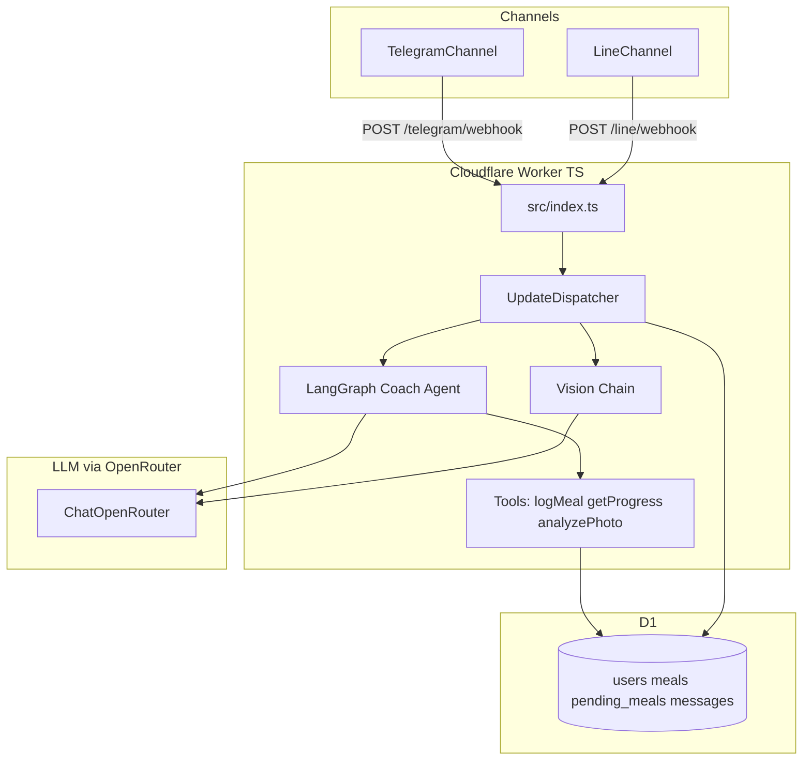
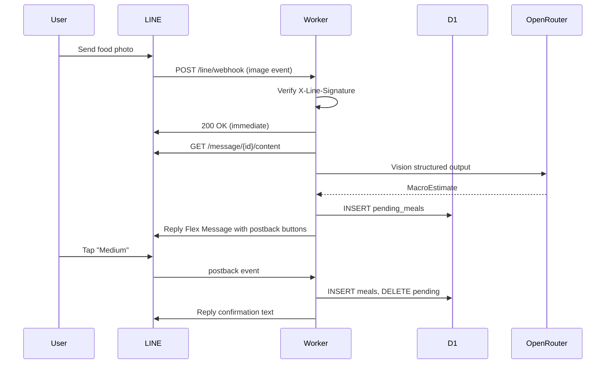

# TypeScript + LangChain Migration Plan

## Current state

The app is a **~1,200-line Python Cloudflare Worker** ([`src/entry.py`](src/entry.py), [`src/app/worker_app.py`](src/app/worker_app.py)) with:
- Telegram webhook → D1 persistence → direct `fetch()` to OpenAI
- Photo flow: download via Telegram `getFile` → base64 vision call → `pending_meals` → inline keyboard confirm → `meals`
- No LangChain, no agents, no LINE

You are already on the `typescript` branch with no TS files yet — this is a greenfield rewrite, not an incremental port.

---

## Target architecture



---

## Phase 0: Telegram image bug (root cause + fix)

The user-facing error `"couldn't read that photo"` comes from the broad `except` in [`_handle_photo`](src/app/worker_app.py) (lines 334–345). Likely causes, ranked:

| # | Issue | Location | Fix in TS |
|---|-------|----------|-----------|
| 1 | **Python Workers `arrayBuffer()` FFI** — `bytes(buffer.to_py() if hasattr(buffer, "to_py") else buffer)` is fragile and may return empty/wrong bytes | [`telegram_httpx.py:104-107`](src/app/channels/telegram_httpx.py) | Use native `const buf = new Uint8Array(await resp.arrayBuffer())` |
| 2 | **Hardcoded `image/jpeg` MIME** — Telegram often serves WebP/PNG; wrong MIME can break vision models | [`worker_app.py:233`](src/app/worker_app.py) | Detect MIME from `Content-Type` header or file extension (`file_path` from `getFile`) |
| 3 | **No HTTP status check** on file download | [`telegram_httpx.py:104`](src/app/channels/telegram_httpx.py) | Check `resp.ok` before reading body; log status + path |
| 4 | **Images sent as documents ignored** — only `message.photo[]` is parsed, not `message.document` with image MIME | [`telegram_httpx.py:148-157`](src/app/channels/telegram_httpx.py) | Also handle `document` where `mime_type` starts with `image/` |
| 5 | **Fragile JSON extraction** — brace-slicing vision response | [`worker_app.py:243-245`](src/app/worker_app.py) | Replace with LangChain `withStructuredOutput(MacroEstimateSchema)` |

**Immediate debug step** (before/during migration): add structured logging at each step — `getFile` result, download status, byte length, detected MIME — so failures are attributable instead of swallowed.

---

## Phase 1: TypeScript Worker scaffold

Replace Python with a standard TS Worker layout:

```
src/
  index.ts                    # fetch router (replaces entry.py)
  env.ts                      # Env bindings type (D1, secrets)
  config.ts                   # settings from env
  db/
    client.ts                 # D1 helpers (_all, _first, _run)
    users.ts, meals.ts, messages.ts, pending-meals.ts
  channels/
    types.ts                  # InboundMessage, MessagingChannel interface
    telegram.ts               # TelegramChannel
    line.ts                   # LineChannel (Phase 4)
  agents/
    coach.ts                  # LangGraph ReAct agent
    vision.ts                 # structured-output vision chain
    tools/
      get-progress.ts
      log-meal.ts
      get-recent-meals.ts
  services/
    context.ts                # recent_context builder
    pending-meal.ts           # action_factors, normalizeAction
    text-style.ts             # stripEmoji, styleChatReply
  schemas/
    nutrition.ts              # MacroEstimate Zod schema
  handlers/
    dispatcher.ts             # processUpdate (replaces worker_app.py)
    commands.ts
    photo.ts
    confirmation.ts
package.json
tsconfig.json
wrangler.toml                 # main = "src/index.ts", nodejs_compat
vitest.config.ts
```

**Key tooling:**
- `wrangler` with `compatibility_flags = ["nodejs_compat"]` (LangChain edge builds)
- `vitest` + `@cloudflare/vitest-pool-workers` for D1/integration tests
- Remove `python_workers` flag and all `src/**/*.py` after parity

**wrangler.toml changes:**
- `main = "src/index.ts"`
- Keep existing D1 binding (`arnold`)
- Add secrets: `OPENROUTER_API_KEY`, `LINE_CHANNEL_SECRET`, `LINE_CHANNEL_ACCESS_TOKEN`
- Add `ADMIN_SECRET` for protecting `/admin/*` (fixes unauthenticated admin routes from prior review)

---

## Phase 2: OpenRouter + LangChain integration

Use the **first-party** `@langchain/openrouter` package — not `ChatOpenAI` with `baseURL` override (loses provider metadata, breaks structured output on some models).

```typescript
// src/agents/llm.ts
import { ChatOpenRouter } from "@langchain/openrouter";

export function createChatModel(env: Env) {
  return new ChatOpenRouter({
    model: env.OPENROUTER_MODEL ?? "openai/gpt-4o",
    apiKey: env.OPENROUTER_API_KEY,
    temperature: 0.4,
    siteUrl: env.PUBLIC_BASE_URL,
    siteName: env.APP_NAME ?? "tryarnold",
  });
}

export function createVisionModel(env: Env) {
  return new ChatOpenRouter({
    model: env.OPENROUTER_VISION_MODEL ?? "openai/gpt-4o",
    apiKey: env.OPENROUTER_API_KEY,
    temperature: 0.2,
  });
}
```

**Env vars** (replace `OPENAI_API_KEY`):

| Variable | Example | Purpose |
|----------|---------|---------|
| `OPENROUTER_API_KEY` | `sk-or-...` | Single key for all models |
| `OPENROUTER_MODEL` | `openai/gpt-4o` | Coach chat |
| `OPENROUTER_VISION_MODEL` | `openai/gpt-4o` | Photo analysis |
| `OPENROUTER_PROVIDER_ORDER` | `OpenAI,Anthropic` | Optional routing preference |

**Switching models** is env-only — change `OPENROUTER_MODEL` to any [OpenRouter model ID](https://openrouter.ai/models) (e.g. `anthropic/claude-sonnet-4`, `google/gemini-2.5-flash`). No code changes needed.

**Packages to install** (avoid `@langchain/community` — Node `createRequire` issues on Workers):
```
@langchain/core
@langchain/openrouter
@langchain/langgraph
zod
```

---

## Phase 3: LangGraph coach agent with tools

Replace the raw `openai_chat()` + inline system prompt with a **ReAct agent** that has fitness-specific tools.

### Vision chain (photo path)
[`src/agents/vision.ts`](src/agents/vision.ts) — not an agent loop; a single structured-output call:

```typescript
const visionModel = createVisionModel(env).withStructuredOutput(macroEstimateSchema, {
  name: "meal_estimate",
  method: "jsonSchema",
  strict: true,
});
```

Input: `HumanMessage` with text prompt + `image_url` using detected MIME (`data:image/webp;base64,...`).

### Coach agent (text path)
[`src/agents/coach.ts`](src/agents/coach.ts) — LangGraph `createReactAgent`:

| Tool | Behavior |
|------|----------|
| `get_progress` | Query D1 `daily_totals` for user |
| `get_recent_meals` | Last N meals for context |
| `log_meal_from_text` | Structured extraction → INSERT `meals` (fixes gap where text meals were never persisted) |

System prompt injects D1 context (timezone, goals, recent chat) via `services/context.ts`.

Agent invocation from dispatcher:
1. Load user + context from D1
2. `agent.invoke({ messages: [new HumanMessage(text)] })`
3. `styleChatReply()` on output
4. Send via channel + log to `messages`

### Photo + confirmation flow (unchanged UX, better internals)
Keep the existing two-step UX (estimate → buttons → confirm) because Telegram/LINE both need explicit user confirmation for portion sizing. The agent handles free-text; the photo path uses the vision chain + pending meal state machine (ported from [`pending_meal.py`](src/app/services/pending_meal.py)).

---

## Phase 4: LINE messaging channel

LINE differs significantly from Telegram. Key design decisions:

### Webhook endpoint
- `POST /line/webhook` in [`src/index.ts`](src/index.ts)
- Verify `X-Line-Signature` HMAC-SHA256 of raw body against `LINE_CHANNEL_SECRET`
- Return `200` immediately; use `ctx.waitUntil()` for processing (TS Workers handle D1 in background reliably — unlike Python Workers)

### Identity model (schema migration required)
Current schema has `users.telegram_id INTEGER UNIQUE`. Add migration `0003_multi_channel.sql`:

```sql
ALTER TABLE users ADD COLUMN channel TEXT DEFAULT 'telegram';
ALTER TABLE users ADD COLUMN external_user_id TEXT;
-- Backfill: UPDATE users SET external_user_id = CAST(telegram_id AS TEXT);
-- New unique index: CREATE UNIQUE INDEX ix_users_channel_external ON users(channel, external_user_id);
```

LINE user IDs are **strings** (e.g. `U4af4980629...`), not integers.

### LINE channel adapter ([`src/channels/line.ts`](src/channels/line.ts))

| Telegram concept | LINE equivalent |
|------------------|-----------------|
| `sendMessage` | `POST /v2/bot/message/reply` (with `replyToken`) or `push` |
| Inline keyboard (`callback_query`) | **Flex Message** buttons with `action.type: "postback"` and `data: "meal:log"` |
| `getFile` + download | `GET https://api-data.line.me/v2/bot/message/{messageId}/content` |
| `chat_id` (int) | `source.userId` (string) |
| Webhook secret header | `X-Line-Signature` body HMAC |

### LINE image download
```typescript
async downloadImage(messageId: string): Promise<{ bytes: Uint8Array; mime: string }> {
  const resp = await fetch(
    `https://api-data.line.me/v2/bot/message/${messageId}/content`,
    { headers: { Authorization: `Bearer ${accessToken}` } }
  );
  if (!resp.ok) throw new Error(`LINE content fetch failed: ${resp.status}`);
  const mime = resp.headers.get("content-type") ?? "image/jpeg";
  return { bytes: new Uint8Array(await resp.arrayBuffer()), mime };
}
```

### LINE portion confirmation UI
Telegram inline keyboards don't exist on LINE. Use a **Flex Message bubble** with button components:

```json
{
  "type": "flex",
  "altText": "Confirm meal portion",
  "contents": {
    "type": "bubble",
    "body": { "type": "box", "layout": "vertical", "contents": [
      { "type": "text", "text": "Chicken rice ~600 kcal. How big was it?" }
    ]},
    "footer": { "type": "box", "layout": "horizontal", "contents": [
      { "type": "button", "action": { "type": "postback", "label": "Small", "data": "meal:size_s" }},
      { "type": "button", "action": { "type": "postback", "label": "Medium", "data": "meal:size_m" }},
      { "type": "button", "action": { "type": "postback", "label": "Large", "data": "meal:size_l" }}
    ]}
  }
}
```

Handle `postback` events in `parseUpdate()` — maps to same `normalizeAction()` logic as Telegram callbacks.

### LINE setup checklist
1. Create LINE Official Account + Messaging API channel at [LINE Developers Console](https://developers.line.biz/)
2. Issue Channel Secret + long-lived Channel Access Token
3. Set webhook URL to `{PUBLIC_BASE_URL}/line/webhook`
4. Enable webhook + disable auto-reply messages in console
5. `wrangler secret put LINE_CHANNEL_SECRET` and `LINE_CHANNEL_ACCESS_TOKEN`

### Shared dispatcher
Extend [`MessagingChannel`](src/app/channels/base.py) interface in TS to support both channels. The dispatcher in `handlers/dispatcher.ts` stays channel-agnostic — only `channels/*.ts` differ.



---

## Phase 5: D1 schema cleanup + fixes from prior review

Port these improvements during migration:

| Issue | Fix |
|-------|-----|
| Text meals not persisted | `log_meal_from_text` agent tool |
| Daily totals always UTC | Use `users.timezone` with `Intl` or `Temporal` for day boundaries |
| `PENDING_MEAL_TTL_MINUTES` unused | Reject stale pending meals on confirm |
| Unauthenticated `/admin/*` | Require `X-Admin-Secret` header |
| `_worker_env_global` race | Pass `env` explicitly everywhere (TS has no ContextVar workaround needed) |
| Dead schema (`goals`, `workouts`, `metrics`) | Defer or drop in migration `0003` |

Generalize `meals.tg_file_id` → `media_ref` (channel-agnostic file reference) in a follow-up migration.

---

## Phase 6: Testing + deployment

**Tests** (new, currently zero):
- `normalizeAction` unit tests
- `MacroEstimateSchema` parse tests
- Telegram `downloadPhoto` with mocked fetch (status, MIME, byte length)
- LINE signature verification
- D1 integration: photo → pending → confirm → meal row
- Agent tool: `log_meal_from_text` persists to D1

**Deploy sequence:**
1. `npm install && npx wrangler deploy`
2. Apply D1 migrations: `npx wrangler d1 migrations apply arnold --remote`
3. Set secrets: `OPENROUTER_API_KEY`, Telegram secrets, LINE secrets, `ADMIN_SECRET`
4. `POST /admin/set-webhook` (Telegram) with admin secret
5. Configure LINE webhook in console
6. Verify: text chat, photo meal, portion buttons, `/progress` on both channels

**Decommission Python:** Remove `src/**/*.py`, `pyproject.toml`, `python_workers` flag after TS parity verified.

---

## File mapping (Python → TypeScript)

| Python | TypeScript |
|--------|------------|
| [`src/entry.py`](src/entry.py) | `src/index.ts` |
| [`src/app/worker_app.py`](src/app/worker_app.py) | `src/handlers/dispatcher.ts` + `photo.ts` + `confirmation.ts` + `commands.ts` |
| [`src/app/channels/telegram_httpx.py`](src/app/channels/telegram_httpx.py) | `src/channels/telegram.ts` |
| [`src/app/channels/base.py`](src/app/channels/base.py) | `src/channels/types.ts` |
| [`src/app/config.py`](src/app/config.py) | `src/config.ts` |
| [`src/app/schemas/nutrition.py`](src/app/schemas/nutrition.py) | `src/schemas/nutrition.ts` (Zod) |
| [`src/app/services/pending_meal.py`](src/app/services/pending_meal.py) | `src/services/pending-meal.ts` |
| [`src/app/text_style.py`](src/app/text_style.py) | `src/services/text-style.ts` |
| `openai_chat()` + `estimate_from_image()` | `src/agents/coach.ts` + `src/agents/vision.ts` |

---

## Risk notes

- **LangChain bundle size**: Workers now allow 64 MiB uncompressed; stick to `@langchain/core`, `@langchain/openrouter`, `@langchain/langgraph` only — avoid `@langchain/community`
- **LINE `replyToken` expires in ~30s**: Return 200 immediately, process in `waitUntil`
- **LINE has no inline callback spinner**: No `answerCallback` equivalent; postback is fire-and-forget
- **OpenRouter vision model selection**: Not all OpenRouter models support images — default to `openai/gpt-4o` or verify on [models page](https://openrouter.ai/models?input_modalities=image)
